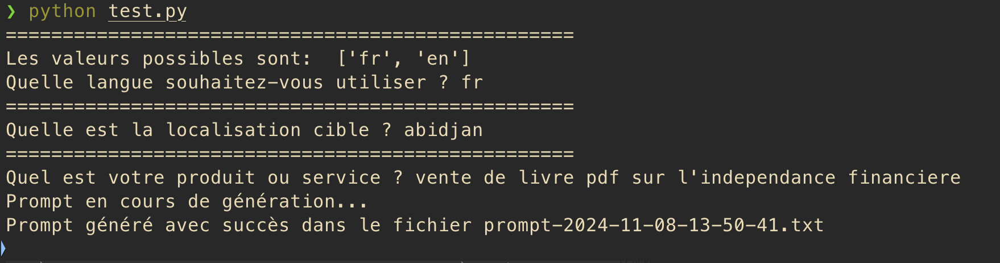

# aiprm-generator

## Générateur de Prompts

Ce projet est un générateur de prompts automatisé qui permet de créer des fichiers de texte formatés en fonction des entrées utilisateur. Il est conçu pour être utilisé avec des plateformes comme Facebook et Instagram, et pour fournir des prompts à des IA génératives telles que ChatGPT, Claude, etc.

### Structure du Projet

#### Fichiers Principaux

- `main.py` : Le script principal qui génère les prompts en fonction des entrées utilisateur.
- `constants.py` : Contient les constantes utilisées dans le projet, telles que les labels des entrées et les chemins de fichiers.
- `clean.py` : Un script pour nettoyer le dossier `output` en supprimant tous les fichiers générés.
- `templates/prompt-001.txt` : Le fichier de template utilisé pour générer les prompts.

### Utilisation

#### Exécution du Générateur de Prompts

Pour exécuter le générateur de prompts, lancez le script `main.py` :

#### Exemple d'utilisation



```sh
python [main.py](http://_vscodecontentref_/##%7B%22uri%22%3A%7B%22%24mid%22%3A1%2C%22fsPath%22%3A%22%2FUsers%2Fcarion%2Fzeus%2Fgeasscorp%2Faiprm-generator%2Fmain.py%22%2C%22path%22%3A%22%2FUsers%2Fcarion%2Fzeus%2Fgeasscorp%2Faiprm-generator%2Fmain.py%22%2C%22scheme%22%3A%22file%22%7D%7D)
